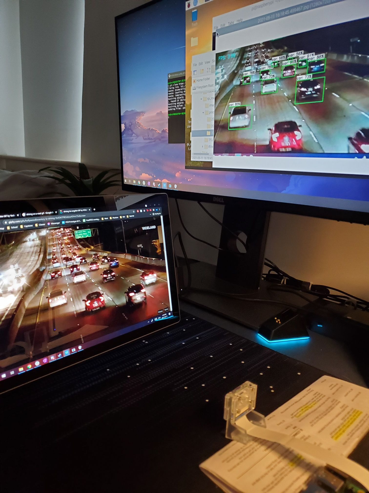

# ML Object detection on embedded systems

an machine learning project suited for object detection, trained on the [bdd100k Dataset](https://bair.berkeley.edu/blog/2018/05/30/bdd/), designed to run on an embedded system (Raspberry Pi, Nvidia Jetson Nano). 

### Requirements: 
- Develop a model that can identify road objects such as cars, buses, pedestrians, etc.
- Implement the model on an embedded device using a camera for real-time processing or with a video stream

Object Detection: Locate the presence of objects with a bounding box and types or classes of the located objects in an image.
Input: An image with one or more objects.
Output: One or more bounding boxes (defined by x,y coordinates), and a class label for each bounding box.

YOLO
- Single stage detector
- Convolutional Neural Network to extract features -> a series of layers to mix and combine features -> Dense prediction of each pixel
- Generates class probabilities for many overlapping regions
- Treats object detection as a regression problem
- Much faster than R-CNN at a slight cost of accuracy

Frameworks
- Darknet --> Popularly used with YOLO
- PyTorch --> Preferred in Academia
- TensorFlow Lite --> Preferred in Industry

